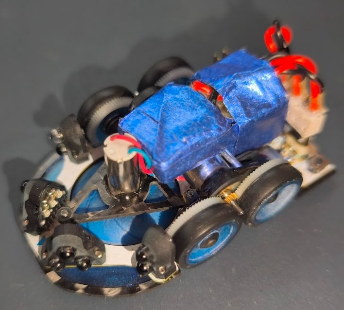
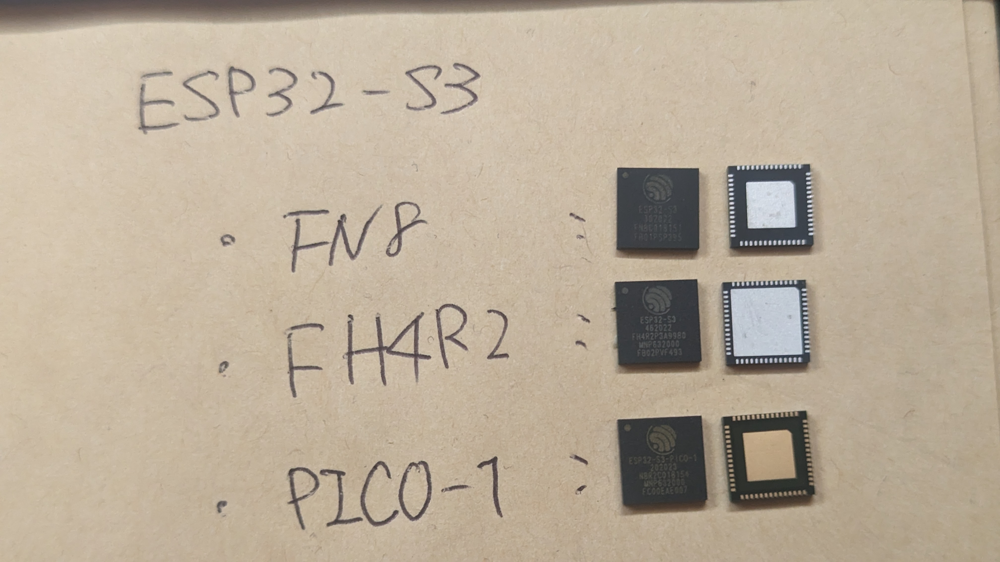
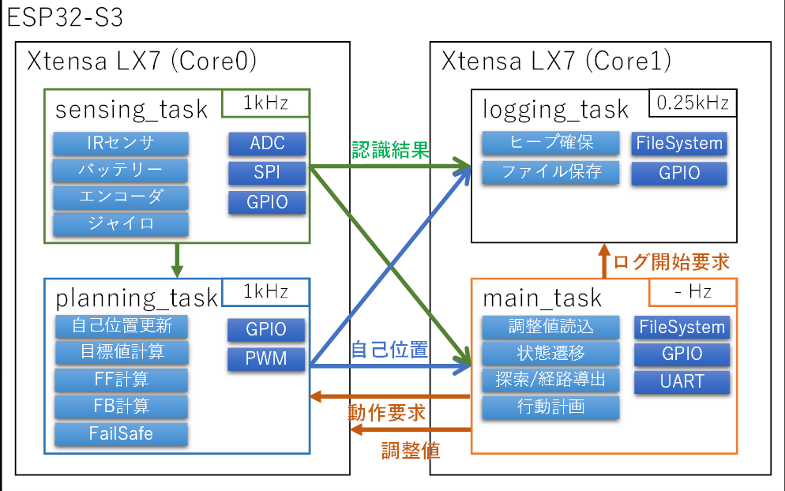
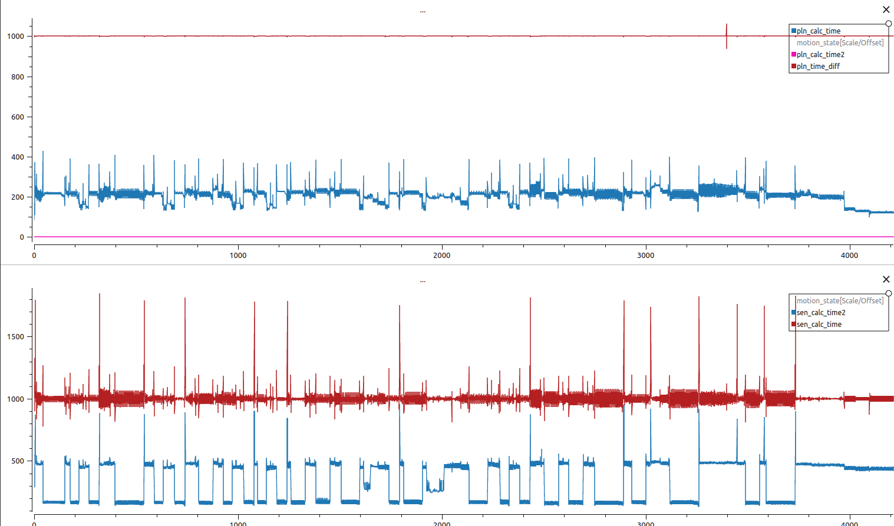
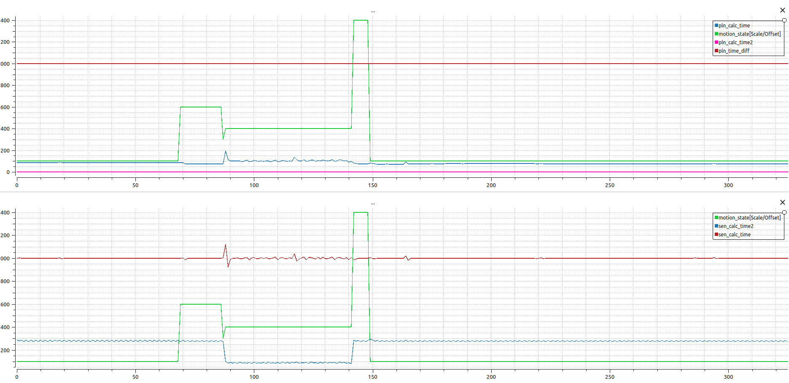

# Astraea/AstraeaNova/AstraeaAlter
 
2023年全日本大会で突貫で3セル化したBanshee.SSSをベースに、正式な3セル機として作成したシリーズ。  
Banshee.SSSでは足りなかったトルクをφ8.5mmのモーターに変更しつつ、制御システムを刷新。
足回りについてはマイクロマウス合宿で発表した「ベアリングホルダー方式」を採用することで、足回りの剛性を強化。高速走行時の安定性につなぐことができた機体です。

このリポジトリでは、Astraea/AstraeaNovaで利用しているすべてのソースコードと基板のファイルを公開しています。

## 利用部品解説

### 1. CPU
ESP32-S3の以下の型番を利用
* ESP32-S3-PICO-1 (Astraea/AstraeaNova/AstraeaAlter)

上記の2モデルは昨年発売されておらず、今シーズンから採用。  
昨年使用していたESP32-S3-FN8との違いはPSRAMが搭載で、2MBまでログを取得できるようになったことで細かい解析ができるようになった。

ESP32-PICO-1ではオシレーターの内蔵版となったことで部品点数削減につながった。

画像の通りパッドに違いがある。

#### 1.1 困ったこと
#### 1.1.1 FreeRTOSの固着
ESP32-S3の水晶発信子が必要なFN8とFH4R2ではデータシートにオシレーターの推奨回路が提示されている。しかし、そのとおり実装すると、モーターを高Dutyで回した際に、FreeRTOSが停止するという問題が発生、推奨回路のコンデンサを除去することで解決した。

#### 1.1.2 データシートにないピンの初期値High問題
書き込み時、電源投入時にHighを出力するピンが存在した。  
ESP32の他シリーズではデータシートに記載しているものもあるがS3では未記載である。
モータードライバにつながったピンに利用すると書き込み時にDuty100%で回転するなど、運用面の問題が発生するため回路の作り直しにつながった。

以下が問題のピン
* PIN26: GPIO20
* PIN28: GPIO26
* PIN44: GPIO39
> 他にもある可能性があり。

### 2. MotorDriver
* MP6551  (AstraeaNova/AstraeaNova/AstraeaAlter)

#### 2.1 MP6551
2023年全日本クラシックチャンピオンが採用していた。採用理由は以下の通り。
1. ICの内部抵抗が非常に小さい
2. ICのロジック電源を必要としない（ロジック用の3.3~5V電圧を必要としない）
3. スイッチング周波数が最大500kHzと高く、モーターの特性に対応しやすい。

### 3. PowerSupply
#### 3.1 LXDC55
2セル、3セルから直接3.3Vを取得する場合損失が大きく、熱による影響と効率の観点からDCDCコンバータを採用。入力側に容量が大きいコンデンサをつけないとノイズが乗りやすいため、高分子タンタルコンデンサを複数搭載することでノイズ問題は解決した。

> 約4.2Vを出力するよう、500Ωを利用。  

秋月にて購入できるため採用。

#### 3.2 MIC5219-3.3YM5
3.3V出力に利用。LEDの出力を大きくしたため、500mA出力できるこのICを採用。
データシート通りバイパス用のピンに470pFのコンデンサをつけることでノイズの低減効果がある。

秋月にて購入できるため採用。

### 4. LED + PhotoTransistor
* LED:
  * OSI5FU3A11C (AstraeaNova/AstraeaAlter)
* PhotoTransistor: 
  * LTR-4206E

BCR421UFD（定電流回路）を使用。抵抗値はそれぞれ5Ω。

#### 5. IMU
ASM330LHHを採用。4000deg/sec対応している最新のIMU。（車載対応品）

#### 6. encoder
AS5147Pを採用。14bit対応+28000RPMまで対応しているため継続採用。

ベアリングホルダー方式ではエンコーダ基板に穴を開けることで位置決めしやすいした。

## システム解説

Espressif社がESP32向けにカスタムしたFreeRTOSを利用。  
マイクロマウスでは一定周期で実行したい処理と非同期で実行したい処理が大きく分かれる、これらが混在すると周期に乱れが生じてしまう。ESP32-S3はCPUを2コア搭載していることから、物理的に分けて処理することでシステム全体を滞りなく動かすことを狙った設計となっている。

### 工夫
リアルタイムOSを利用しているとはいえ、タスクの優先順位次第では一定周期で処理できないことがある。特にエンコーダは前回値との差を使い速度を算出するため時刻差の影響を大きく受けた。

対策として、前回取得した時刻を記憶、現在時刻との差分から速度、距離の算出に利用したことで制御・判断の精度向上した。

### 解決した済みの課題

上記の画像は上側がplanning_task、下側がsensing_taskの処理時間(μsec)のログである。  
特にsensing_taskでは、定期的に1000μsecを大きく超え、周期が安定しないときが見られる。
また、planningのタスクの優先度を高く設定しているため、安定しているように見える。

原因は2つ判明しており、  
1つ目はmain_taskから要求される指示メッセージの処理不可が大きい点  
2つ目はセンサーに使用するAD変換に時間がかかる点  
である。

メッセージの送信自体が重くデータは構造体ではなく、ポインタを送信しているためデータ量に起因するものではないため、改善が難しい。
AD変換もESP32自体がIoT向けのマイコンである点からあまり得意でないことから改善が不可能である。

AD変換については、常にすべてのAD変換を行うのではなく、重要度の低いものは１回おきに取得することでシステム全体の負荷を下げるなどの工夫はしているが不十分な状況である。

#### 根本解決
以下の３つを実施したことで、解決。
1. メッセージ処理時間の遅延はFreeRTOSのqueueを使った指示を廃止しnotifyを採用。
    * メッセージのやり取りが重く、ボトルネックとなっていた。notifyにしても多少遅れはあるが、queueに比べると少ないため許容した。
    * shared_ptrで予め実態は共有。変更したことだけをmainからtasskにnotifyで通知し、通知が来たら処理を変更するとした。
2. 一部の処理をIRAM上に配置するように修正
    * ESP32ではデフォルトでフラッシュ上にプログラムが展開される。関数単位で処理速度が早いIRAMに展開する要支持することで大幅改善。
3. esp-idfのSPIとADCの実装を改造
    * 実行時に毎回、初期化に近い処理や不要な排他処理の手続きなどをしていたので排除。
    

## change log
1. Astraea
2. AstraeaNova
3. AstraeaAlter